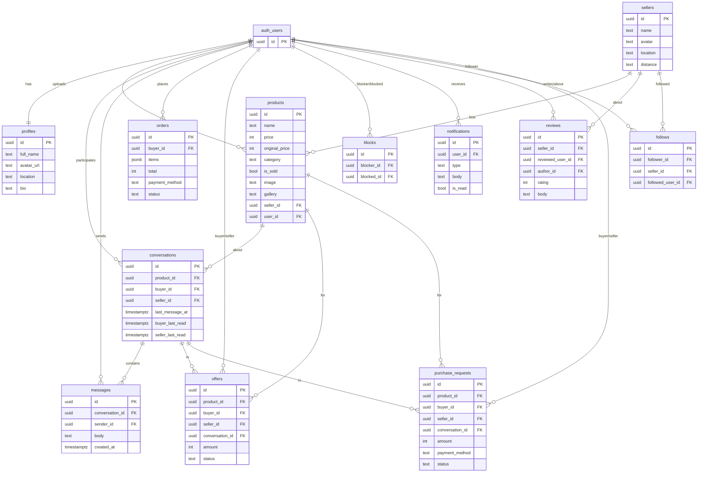
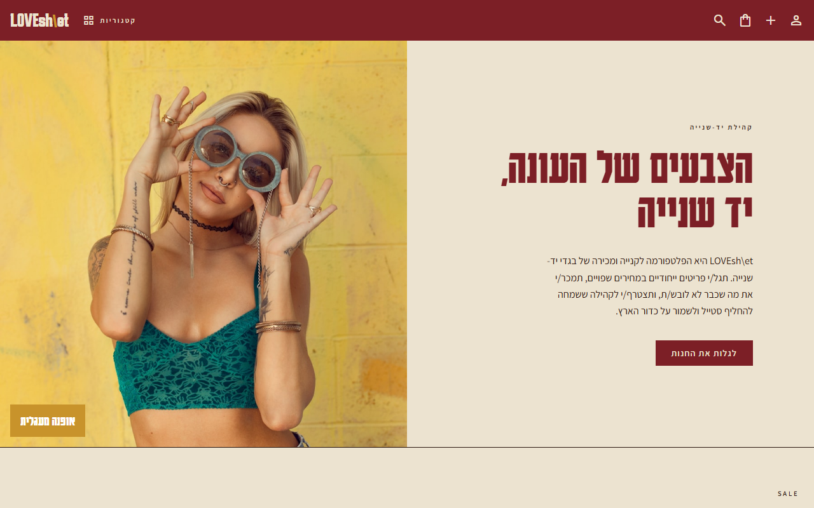
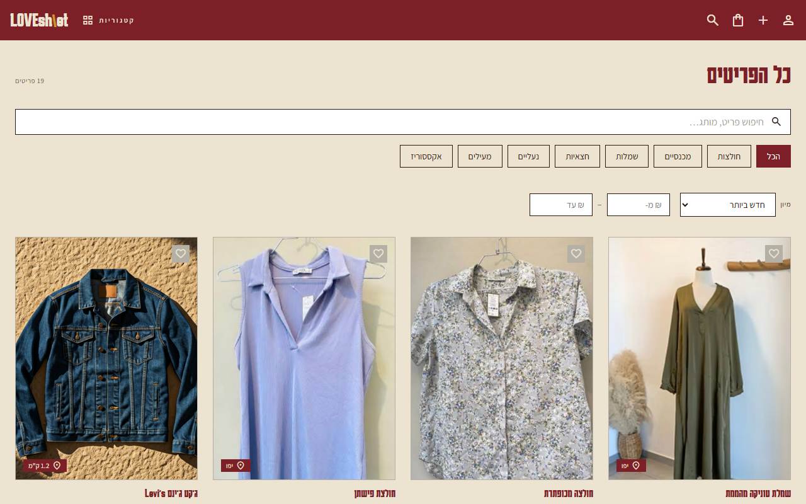
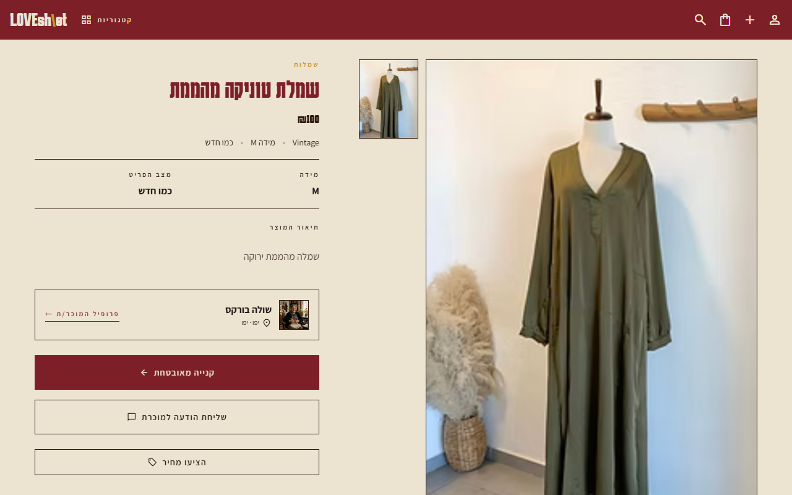
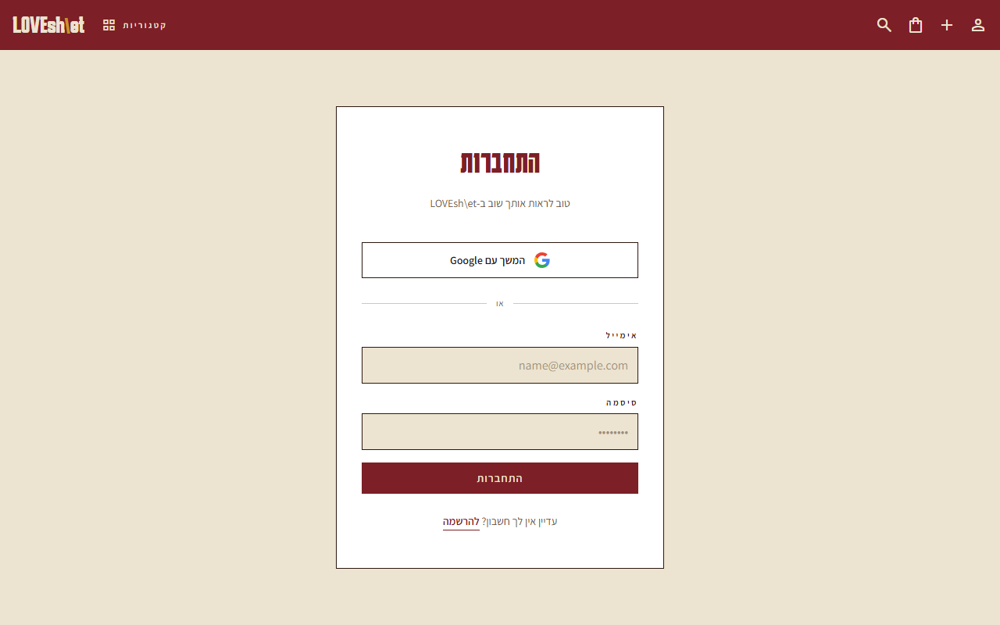
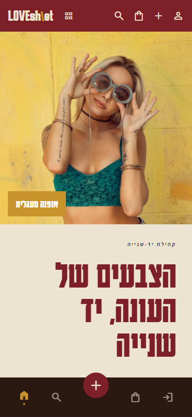
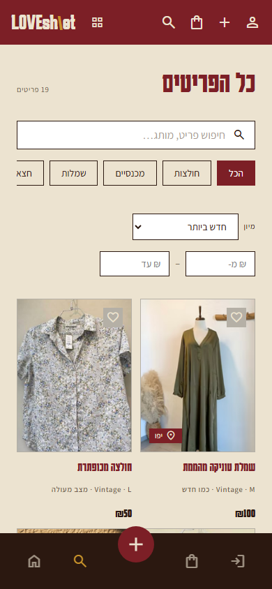

<div align="center">


**הקריה האקדמית אונו** · הפקולטה למנהל עסקים (מערכות מידע)

**נושא העבודה:** פרויקט מסכם בפיתוח אתרים

**שם הקורס:** פיתוח אתרים · **מרצה:** מר יריב גלעד

**מגישה:** מריה קוטושוב · **ת"ז:** 212733323

**תאריך הגשה:** 26.6.26

</div>

---

# LOVEsh\et — חנות יד-שנייה אונליין 🛍️

מרקטפלייס ישראלי (RTL, עברית) לקנייה ומכירה של בגדי יד-שנייה — אופנה מעגלית, מחירים שפויים וקהילה.
A Hebrew, right-to-left second-hand fashion marketplace: buy, sell, chat, follow, and review.

### 🔴 [**Live site → lovesh-et.vercel.app**](https://lovesh-et.vercel.app)

[](https://lovesh-et.vercel.app)

---

## 📝 סקירה כללית (Overview)

<div dir="rtl">

**LOVEsh\et** היא פלטפורמת מרקטפלייס לקנייה ומכירה של בגדי **יד-שנייה** — אופנה מעגלית
(circular fashion) במקום צריכה מתכלה. כל משתמש/ת יכול/ה להעלות פריטים למכירה עם תמונות,
לנהל את החנות האישית, לשוחח בצ'אט בזמן אמת עם קונים/מוכרים, לעקוב אחרי מוכרים, להשאיר
דירוגים וביקורות, ולבצע רכישה שמאושרת על ידי המוכר/ת **בתוך השיחה** לפני סגירתה. הממשק
כולו בעברית, מימין-לשמאל (RTL), ומותאם לדסקטופ ולנייד.

</div>

## 🎯 הבעיה שאנחנו פותרים (The Pain)

<div dir="rtl">

תעשיית ה-Fast Fashion יוצרת בזבוז עצום ועלויות גבוהות, בעוד שוק היד-שנייה הקיים מבוזר
ולא נוח: קבוצות פייסבוק עמוסות וללא סדר, אין דירוגי אמון למוכרים, אין ניהול מלאי, ואין
דרך בטוחה לתאם תשלום ואיסוף. הקונה לא יודע למי הוא קונה, והמוכר מתקשה לחשוף את הפריטים שלו
לקהל ממוקד. **LOVEsh\et** הופכת את התהליך למסודר, אמין ומהנה.

</div>

## 👥 קהל היעד (Target Audience)

<div dir="rtl">

1. **צעירים/ות מודעי-סביבה** שמחפשים אופנה משתלמת ומקיימת, ואוהבים פריטים ייחודיים.
2. **מוכרים/ות פרטיים** שרוצים לפנות את הארון, לתת לבגדים חיים שניים ולהרוויח בדרך.

</div>

## ⚔️ מתחרים ובידול (Competitors & Differentiation)

| הכאב (Pain) | קטגוריה | מתחרה |
| --- | --- | --- |
| לא מסודר, ללא דירוג/אמון | קבוצות יד-שנייה | קבוצות פייסבוק / וואטסאפ |
| כללי מדי, לא ממוקד אופנה | מרקטפלייס כללי | יד2 · Facebook Marketplace |
| מוגבל גאוגרפית, מלאי קטן | חנויות וינטג' פיזיות | חנויות יד-שנייה מקומיות |

### 🚀 ה-Wow Factor

<div dir="rtl">

1. **חוויית עברית מלאה (RTL)** ומערכת עיצוב אחידה — לא תרגום של מוצר לועזי.
2. **צ'אט בזמן אמת עם אישור עסקה בתוך השיחה** — המוכר/ת מאשר/ת את ה-Bit/המפגש לפני סגירה,
   ושני הצדדים יודעים בדיוק עם מי הם מתקשרים.
3. **קהילה ואמון** — מעקב אחרי מוכרים, דירוגים וביקורות, ומפת מיקום לאיסוף.

</div>

## ✨ Features

- **Catalogue** — home with a sale carousel + "new in"; shop page with category
  navigation, **sub-categories**, free-text search, sort, and a price-range filter.
- **Product page** — image gallery, seller card + Google-Maps pickup location,
  ratings, similar items, add-to-cart, **make an offer**, and message the seller.
- **Cart & checkout** — cart with totals; checkout (sign-in required) with Bit /
  pay-in-person. Buying a listing opens a chat with the seller and creates a
  **purchase request the seller approves/declines inside the conversation**
  before it's final.
- **Auth** — email/password + **Google** sign-in (Supabase Auth).
- **Profiles** — private profile (avatar, bio, location, my listings, orders,
  offers received) and **public profiles** for sellers and users.
- **Seller tools** — upload items with multiple photos, edit / delete, mark as
  sold (sold items are hidden from the shop and shown blurred on the profile).
- **Messaging** — realtime buyer⇄seller chat (Supabase Realtime). Messaging a
  seller, **price offers**, and **purchase requests** all share **one
  conversation per product** — no duplicate chats are opened. The seller
  **accepts/declines offers and approves/declines purchases inside the chat**.
- **Block users** — either side can block the other from a conversation or a
  user's profile; blocked users can no longer message one another.
- **Notifications** — orders, offers (in chat), purchase requests, new followers,
  system.
- **Follow** — follow sellers and users; follower counts.
- **Reviews & ratings** — star reviews on sellers and users.
- **Inclusive Hebrew** copy (תכתב/י, תשלח/י…), fully responsive, and a friendly
  Sentry error screen.

## 🎨 UI/UX Design

- **Design system as source of truth** — colours, typography, spacing and component
  patterns come from `DESIGN.md` tokens, translated into CSS custom properties in
  [src/styles/globals.css](src/styles/globals.css); components reference variables
  (e.g. `var(--color-primary)`), never hard-coded values.
- **Right-to-left (RTL)** Hebrew layout throughout, with gender-inclusive copy
  (תכתב/י, תשלח/י…).
- **Mobile-first & responsive** — verified on desktop (1280px) and phone (390px)
  with no horizontal scroll; a bottom nav bar on mobile.
- **High design fidelity** — screens built to match the exported Stitch references
  (`code.html` + `screen.png`).
- **Clear states** — loading, empty and error states for every async screen.

## 🧩 Frontend & Functionality

- **React SPA** (Vite) with **route-level code-splitting** (`React.lazy` + `Suspense`)
  for fast first load.
- **Component-driven** — pages are composed from small, reusable components
  (one component per folder), never monolithic.
- **State via Context** — Auth, Cart and Favorites providers; cart/favorites persist
  in `localStorage`.
- **Realtime** — chat messages and notifications update live via Supabase Realtime
  channels.
- **Resilient** — best-effort flows that don't block the user, and a friendly Sentry
  error-boundary screen on unexpected crashes.

## 🧱 Tech stack

- **Vite + React 19** (JavaScript, not TypeScript) · **React Router**
- **Supabase** — Postgres, Auth, Storage, Realtime ([src/lib/supabase.js](src/lib/supabase.js))
- **Vercel** — hosting + Web Analytics
- **Sentry** (errors + replay) · **Microsoft Clarity** (behaviour analytics)
- Styling: plain CSS driven by **design tokens** ([src/styles/globals.css](src/styles/globals.css))

## 🔌 External services

| Service | Used for | Configured via |
| --- | --- | --- |
| **Supabase** | Postgres DB, Auth (email + Google), Storage (images), Realtime (chat) | `VITE_SUPABASE_URL`, `VITE_SUPABASE_ANON_KEY` |
| **Vercel** | Hosting, auto-deploy, Web Analytics | Vercel dashboard · [vercel.json](vercel.json) |
| **Google OAuth** | "Sign in with Google" (through the Supabase provider) | Supabase → Auth → Providers · Google Cloud Console |
| **Sentry** | Error monitoring + session replay | `VITE_SENTRY_DSN` |
| **Microsoft Clarity** | Behaviour analytics (heatmaps, session recordings) | `VITE_CLARITY_ID` |
| **Unsplash** | Product & avatar imagery (seed data) | image URLs in the seed SQL |
| **Google Maps** | Seller pickup-location map | `<iframe>` embed (no key) |

## 📁 Project structure

```
src/
  components/   reusable UI (Header, ProductCard, FollowButton, ...)
  pages/        route-level screens (Home, Shop, ProductDetail, Profile, ...)
  api/          Supabase data access (products, auth, messages, offers, ...)
  context/      React context (Auth, Cart, Favorites)
  lib/          supabase client + monitoring init
  data/         static content (hero copy, category lists)
  styles/       globals.css design tokens
supabase/       SQL schema, seed, and migrations
```

## 🚀 Local development

```bash
npm install
cp .env.example .env      # then fill in your Supabase values
npm run dev               # http://localhost:5173
```

Build / preview:

```bash
npm run build
npm run preview
```

## 🔑 Environment variables

Create `.env` (gitignored) from [.env.example](.env.example):

```
VITE_SUPABASE_URL=https://YOUR-REF.supabase.co     # base URL, NOT the /rest/v1/ endpoint
VITE_SUPABASE_ANON_KEY=your-anon-public-key
VITE_SENTRY_DSN=          # optional
VITE_CLARITY_ID=          # optional
```

The same variables must be set in **Vercel → Settings → Environment Variables**
(then redeploy — `VITE_*` are baked at build time).

## 🗄️ Database setup (Supabase SQL editor)

Run these once, in order:

1. `schema.sql` — tables (products, sellers), Storage bucket, RLS
2. `seed.sql` — initial catalogue
3. `migration_user_id.sql` — link products to their uploader
4. `migration_category.sql` — categories
5. `migration_sold.sql` — sold flag
6. `migration_messages.sql` — chat (conversations + messages, realtime)
7. `migration_v2.sql` — orders, reviews, notifications
8. `migration_v3.sql` — price offers + seller edit/delete policies
9. `migration_v4.sql` — public profiles
10. `migration_v5.sql` — follow sellers + realistic prices
11. `migration_v6.sql` — catalogue cleanup
12. `migration_v7.sql` — chat read-state
13. `migration_v8.sql` — follow any user
14. `migration_v9.sql` — reviews on any user
15. `migration_v10_security.sql` — tighten insert policies (auth + ownership)
16. `migration_v11_purchases.sql` — purchase requests (seller approval)
17. `migration_v12_purchase_chat.sql` — link purchase requests to the chat
18. `migration_v13_offers_blocks.sql` — offers in chat + block users
19. `seed_fix.sql` — verified product images + seed reviews

Also: create a **public Storage bucket** named `product-images`, set the
**Site URL** to the production URL, and enable the **Google** auth provider.
Full step-by-step in [SETUP.md](SETUP.md).

## 🗺️ Database (ERD)

`auth_users` is Supabase's built-in auth table; all other tables live in the
`public` schema.



## ☁️ Deployment

Hosted on **Vercel** (connected to this GitHub repo). Pushing to `main`
auto-deploys; a manual deploy is `vercel --prod`. SPA routing is handled by
[vercel.json](vercel.json). Checkout requires a signed-in user.

## 🖼️ Screenshots

<div align="center">

<br/>
<em>דף הבית — הירו, קרוסלת מבצעים ו"חדש בחנות"</em>

<br/><br/>

<br/>
<em>החנות — קטגוריות, חיפוש, מיון וסינון מחיר</em>

<br/><br/>

<br/>
<em>עמוד מוצר — גלריה, כרטיס מוכר/ת, מפת איסוף ופריטים דומים</em>

<br/><br/>

<br/>
<em>התחברות / הרשמה — אימייל + Google</em>

</div>

## 📱 Mobile Responsiveness

<div dir="rtl">

האתר תוכנן Mobile-first ונבדק במסך טלפון (390px) ללא גלילה אופקית, עם סרגל ניווט תחתון.

</div>

<div align="center">


&nbsp;&nbsp;


</div>

## 🎁 Excellence, Vibe Coding & AI

<div dir="rtl">

- **בנייה בשיתוף AI** — הפרויקט פותח ב"Vibe Coding" יחד עם **Claude Code** (Anthropic):
  תכנון סכמת ה-Supabase, ה-RLS, רכיבי ה-React והזרימות העסקיות נבנו בעבודה משותפת עם הסוכן.
- **שלמות מוצרית** — מערכת עיצוב אחידה, מצבי טעינה/ריקנות/שגיאה, נגישות ו-RTL מלא.
- **תשתית אמיתית** — Auth, Storage, Realtime ו-RLS על כל טבלה; ניטור עם Sentry, Vercel
  Analytics ו-Microsoft Clarity; פריסה אוטומטית ל-Vercel.

</div>

## 🎨 Design system

Tokens (colors, fonts, spacing, radius) live in [src/styles/globals.css](src/styles/globals.css),
derived from the `DESIGN.md` reference. Components reference CSS variables
(e.g. `var(--color-primary)`) rather than hard-coded values.

---

*Built with React + Supabase.*
