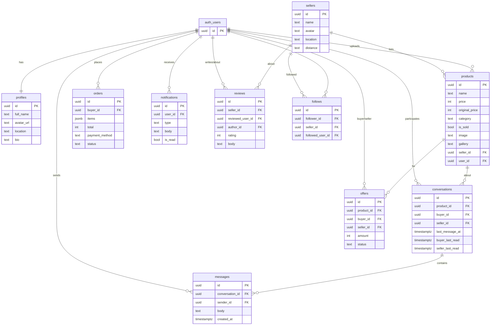

# LOVEsh\et — חנות יד-שנייה אונליין 🛍️

מרקטפלייס ישראלי (RTL, עברית) לקנייה ומכירה של בגדי יד-שנייה — אופנה מעגלית, מחירים שפויים וקהילה.
A Hebrew, right-to-left second-hand fashion marketplace: buy, sell, chat, follow, and review.

### 🔴 [**Live site → lovesh-et.vercel.app**](https://lovesh-et.vercel.app)

[](https://lovesh-et.vercel.app)

---

## ✨ Features

- **Catalogue** — home with a sale carousel + "new in"; shop page with category
  navigation, **sub-categories**, free-text search, sort, and a price-range filter.
- **Product page** — image gallery, seller card + Google-Maps pickup location,
  ratings, similar items, add-to-cart, **make an offer**, and message the seller.
- **Cart & checkout** — cart with totals; checkout with Bit / pay-in-person
  (demo payment, no real charge); orders saved to the buyer's profile.
- **Auth** — email/password + **Google** sign-in (Supabase Auth).
- **Profiles** — private profile (avatar, bio, location, my listings, orders,
  offers received) and **public profiles** for sellers and users.
- **Seller tools** — upload items with multiple photos, edit / delete, mark as
  sold (sold items are hidden from the shop and shown blurred on the profile).
- **Messaging** — realtime buyer⇄seller chat (Supabase Realtime).
- **Notifications** — orders, accepted/rejected offers, new followers, system.
- **Follow** — follow sellers and users; follower counts.
- **Reviews & ratings** — star reviews on sellers and users.
- **Inclusive Hebrew** copy (תכתב/י, תשלח/י…), fully responsive, and a friendly
  Sentry error screen.

## 🧱 Tech stack

- **Vite + React 19** (JavaScript, not TypeScript) · **React Router**
- **Supabase** — Postgres, Auth, Storage, Realtime ([src/lib/supabase.js](src/lib/supabase.js))
- **Vercel** — hosting + Web Analytics
- **Sentry** (errors + replay) · **Microsoft Clarity** (behaviour analytics)
- Styling: plain CSS driven by **design tokens** ([src/styles/globals.css](src/styles/globals.css))

## 🔌 External services

| Service | Used for | Configured via |
| --- | --- | --- |
| **Supabase** | Postgres DB, Auth (email + Google), Storage (images), Realtime (chat) | `VITE_SUPABASE_URL`, `VITE_SUPABASE_ANON_KEY` |
| **Vercel** | Hosting, auto-deploy, Web Analytics | Vercel dashboard · [vercel.json](vercel.json) |
| **Google OAuth** | "Sign in with Google" (through the Supabase provider) | Supabase → Auth → Providers · Google Cloud Console |
| **Sentry** | Error monitoring + session replay | `VITE_SENTRY_DSN` |
| **Microsoft Clarity** | Behaviour analytics (heatmaps, session recordings) | `VITE_CLARITY_ID` |
| **Resend** | Purchase-receipt emails (via a Supabase Edge Function) | `RESEND_API_KEY` secret · [supabase/functions/send-receipt](supabase/functions/send-receipt) |
| **Unsplash** | Product & avatar imagery (seed data) | image URLs in the seed SQL |
| **Google Maps** | Seller pickup-location map | `<iframe>` embed (no key) |

## 📁 Project structure

```
src/
  components/   reusable UI (Header, ProductCard, FollowButton, ...)
  pages/        route-level screens (Home, Shop, ProductDetail, Profile, ...)
  api/          Supabase data access (products, auth, messages, offers, ...)
  context/      React context (Auth, Cart, Favorites)
  lib/          supabase client + monitoring init
  data/         static content (hero copy, category lists)
  styles/       globals.css design tokens
supabase/       SQL schema, seed, and migrations
```

## 🚀 Local development

```bash
npm install
cp .env.example .env      # then fill in your Supabase values
npm run dev               # http://localhost:5173
```

Build / preview:

```bash
npm run build
npm run preview
```

## 🔑 Environment variables

Create `.env` (gitignored) from [.env.example](.env.example):

```
VITE_SUPABASE_URL=https://YOUR-REF.supabase.co     # base URL, NOT the /rest/v1/ endpoint
VITE_SUPABASE_ANON_KEY=your-anon-public-key
VITE_SENTRY_DSN=          # optional
VITE_CLARITY_ID=          # optional
```

The same variables must be set in **Vercel → Settings → Environment Variables**
(then redeploy — `VITE_*` are baked at build time).

## 🗄️ Database setup (Supabase SQL editor)

Run these once, in order:

1. `schema.sql` — tables (products, sellers), Storage bucket, RLS
2. `seed.sql` — initial catalogue
3. `migration_user_id.sql` — link products to their uploader
4. `migration_category.sql` — categories
5. `migration_sold.sql` — sold flag
6. `migration_messages.sql` — chat (conversations + messages, realtime)
7. `migration_v2.sql` — orders, reviews, notifications
8. `migration_v3.sql` — price offers + seller edit/delete policies
9. `migration_v4.sql` — public profiles
10. `migration_v5.sql` — follow sellers + realistic prices
11. `migration_v6.sql` — catalogue cleanup
12. `migration_v7.sql` — chat read-state
13. `migration_v8.sql` — follow any user
14. `migration_v9.sql` — reviews on any user
15. `seed_fix.sql` — verified product images + seed reviews

Also: create a **public Storage bucket** named `product-images`, set the
**Site URL** to the production URL, and enable the **Google** auth provider.
Full step-by-step in [SETUP.md](SETUP.md).

## 🗺️ Database (ERD)

`auth_users` is Supabase's built-in auth table; all other tables live in the
`public` schema.



## ☁️ Deployment

Hosted on **Vercel** (connected to this GitHub repo). Pushing to `main`
auto-deploys; a manual deploy is `vercel --prod`. SPA routing is handled by
[vercel.json](vercel.json).

**Receipt emails** are sent by the `send-receipt` Supabase Edge Function. To
enable: `supabase secrets set RESEND_API_KEY=...` then
`supabase functions deploy send-receipt`. Checkout requires a signed-in user.

## 🎨 Design system

Tokens (colors, fonts, spacing, radius) live in [src/styles/globals.css](src/styles/globals.css),
derived from the `DESIGN.md` reference. Components reference CSS variables
(e.g. `var(--color-primary)`) rather than hard-coded values.

---

*Built with React + Supabase.*
